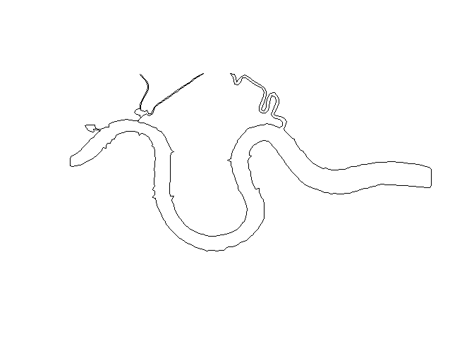
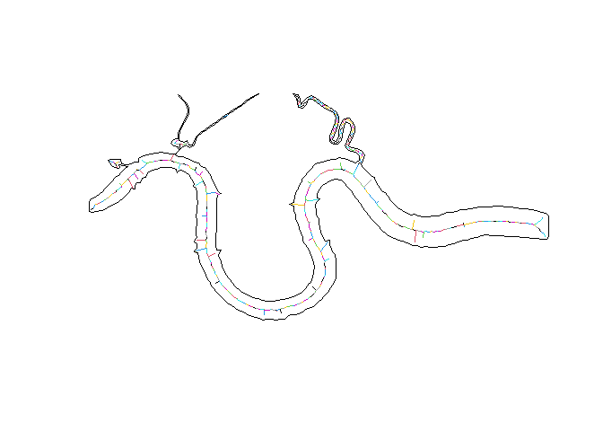
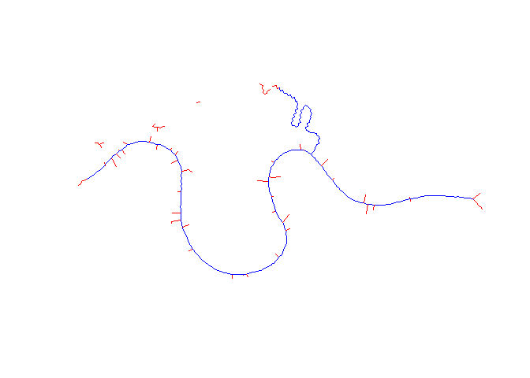

<!-- README.md is generated from README.Rmd. Please edit that file -->

# midlines

<!-- badges: start -->
<!-- badges: end -->

The goal of `midlines` is to estimate the midline of a one or more
polygons, taking as input polygons in the format provided by the
[`sf`](https://github.com/r-spatial/sf) package.

The package is a high level package which wraps around several functions
from other packages, predominantly the
[`sf`](https://github.com/r-spatial/sf) package. `midlines` is still
under development and work on it has been a learning experience for the
author. However, hopefully some users can find the functions useful and
I welcome comments, suggestions and contributions.

## Installation

You can install the package from [GitHub](https://github.com/) with:

``` r
# install.packages("devtools")
# library(devtools)
devtools::install_github("RichardPatterson/midlines")
```

N.B. to install midlines from GitHub, you will need to install and
attach the devtools package if you have not already done so.

## Simple example

The package includes a polygon illustrating a short section of the River
Thames in central London for use as an example. This data is derived
from OpenStreetMap data, which was downloaded from OSMdata package. As
such, copyright is retained by OpenStreetMap contributers.

``` r
library(midlines)
library(sf)
#> Warning: package 'sf' was built under R version 4.0.5
#> Linking to GEOS 3.9.0, GDAL 3.2.1, PROJ 7.2.1
library(units)
#> udunits system database from C:/Users/richa/Documents/R/win-library/4.0/units/share/udunits

thames = thames
thames
#> Simple feature collection with 1 feature and 0 fields
#> Geometry type: POLYGON
#> Dimension:     XY
#> Bounding box:  xmin: 534770 ymin: 177866.8 xmax: 542860 ymax: 181850
#> Projected CRS: OSGB 1936 / British National Grid
#>                         geometry
#> 1 POLYGON ((534811.9 180004.9...

par(mar = c(4, 4, 0.1, 0.1))

plot(thames)
```



To estimate the midline of this stretch of the Thames, the
`midline_draw` function.

``` r
m1 = midlines_draw(thames)
plot(thames)
plot(m1$geometry, col = m1$line_id, add = TRUE)
```

 The function
uses the st_voronoi function from the
[`sf`](https://github.com/r-spatial/sf) package, which uses the points
on the polygon (river) perimeter to perform an
[`Voronoi`](https://en.wikipedia.org/wiki/Voronoi_diagram) tessellation.
Those lines not completely within the polygon are removed. We can see
that the midline of the river is derived but there are lots of
extraneous lines that are also generated by the Voronoi tessellation.
The colour of the estimated midlines illustrate that both the midline
and extraneous lines are made up of multiple line segments. The package
offers some methods to try and remove unwanted line segments without
losing any of the desired midline. The specific method will vary
depending on the input polygon and user requirements.

In the first instance, the `midlines_clean` function can be used to
remove extraneous lines. The function takes the output from
`midlines_draw` and does not remove the lines from the dataset but
attempts to identify (flag) them with the addition of a `removed_flag`
variable, to allow users to explore whether the desired result has been
achieved. By default, it will identify line segments at line ends one at
a time.

``` r
m2 = midlines_clean(m1)
#> Warning in st_cast.sf(x, "POINT"): repeating attributes for all sub-geometries
#> for which they may not be constant
plot(m2$geometry, col = c("BLUE", "RED")[m2$removed_flag])
```



``` r
m2 = m2[m2$removed_flag==0, c(1,2)]
m2 = midlines_clean(m2)
#> Warning in st_cast.sf(x, "POINT"): repeating attributes for all sub-geometries
#> for which they may not be constant
plot(m2$geometry, col = c("BLUE", "RED")[m2$removed_flag])
```


``` r
m2 = m2[m2$removed_flag==0, c(1,2)]
m2 = midlines_clean(m2)
#> Warning in st_cast.sf(x, "POINT"): repeating attributes for all sub-geometries
#> for which they may not be constant
plot(m2$geometry, col = c("BLUE", "RED")[m2$removed_flag])
```


``` r
m2 = m2[m2$removed_flag==0, c(1,2)]
m2 = midlines_clean(m2)
#> Warning in st_cast.sf(x, "POINT"): repeating attributes for all sub-geometries
#> for which they may not be constant
plot(m2$geometry, col = c("BLUE", "RED")[m2$removed_flag])
```

 Having seen
the process, we can achieve the same result with a single call of
`midlines_clean` using the `n_removed` option - in this case four cycles
of line segment removal are completed.

``` r
m2 = midlines_clean(m1, n_removed = 4)
#> Warning in st_cast.sf(x, "POINT"): repeating attributes for all sub-geometries
#> for which they may not be constant
plot(m2$geometry[m2$removed_flag==0], col = "BLUE")
```


This yields a reasonable estimate of the midline of the main channel of
the river, although the midlines of the side branches were not
consistently estimated (see below for more).

## Cleaning the midline

The initial `midline_draw` function will estimate the midlines of a
polygon but this will be adorned with extraneous lines and will possibly
extend into side branches of the polygon (if it has them), which may or
may not be of interest to the user. Removing undesired extraneous lines
and side branches, while retaining the desired midline is the purpose of
several functions in the midlines package. In general there are three
main method used to identify lines for removal/retention, there are the
number of line segments in side branches (seen above in the `n_removed`
option), the `length` of side branches and the use of a border
(`border_line`) to specify the field of interest.

### Number of line segments

As explained above, the `n_removed` option is the number of cycles of
line segment removal. Once all cycles of line removal are complete, the
removed line-segments can be grouped with those they intersect with to
create contiguous groups. This means that removed lines can be
identified based on the number of constituent line segments and the
longer lines can be added back. E.g. if all lines to be removed contain
less than five line segments, after five cycles of removal containing
five or more line segments should *not* be removed. The assumption here
is that those lines with 5 or more lines segments are part of the
estimated main channel midlines and are of interest to the user. To
demonstrate, the example above was satisfactorily cleaned with four
cycles of removal, so if we specify five cycles and use midlines_check
with the n_removed option, it will identify lines of 5 or more segments.

``` r
m2 = midlines_clean(m1, n_removed = 5)
#> Warning in st_cast.sf(x, "POINT"): repeating attributes for all sub-geometries
#> for which they may not be constant
m3 = midlines_check(m2, n_removed = 5)
plot(m3$geometry, col = c("BLUE", "RED")[m3$removed_flag2])
```

 The
`midlines_check` function takes the output from `midlines_clean` and
adds an additional variable unimaginatively named `removed_flag2`. With
both the flag variables, the user can identify those line segments
initially flagged for removal and the unflagged by `midlines_check`.

We can see that now the ends of the main channel midline are restored
but the extraneous lines coming off the midline are flagged for removal.
This yields potentially unsatisfactory results when the there is
branching at the extremities of the midline, as at the Eastern end of
this small example.

### Length

In a similar way to the number of line segments, we can unflag removed
lines based on their length. This can be useful especially where the
extraneous lines contain many very small line segments which are
generated with Voronoi tesselation in small or complex polygons. In the
example, a length of 230 meters results in the same configuration as
unflagging those with five or more line segments.

``` r
m2 = midlines_clean(m1, n_removed = 5)
#> Warning in st_cast.sf(x, "POINT"): repeating attributes for all sub-geometries
#> for which they may not be constant
m3 = midlines_check(m2, length = set_units(230,"m"))
plot(m3$geometry, col = c("BLUE", "RED")[m3$removed_flag2])
```


### Border line

Specifying the field, or area, of interest is another way to control
removal of side branches. When used, line ends that meet the the border
of the area of interest are not affected by attempts to clean the
midlines (or are unflagged). For example, the Eastern and Western
extremities of our stretch of the river Thames can be identified so the
ends of the desired midline are not removed.

``` r
m2 = midlines_clean(m1, n_removed = 10)
#> Warning in st_cast.sf(x, "POINT"): repeating attributes for all sub-geometries
#> for which they may not be constant

bbox_line = st_cast(st_as_sfc(st_bbox(c(xmin = 535070, ymin = 177800, xmax = 542560, ymax = 181550), crs = 27700)), "LINESTRING")
m3 = midlines_check(m2, border_line = bbox_line)
plot(m3$geometry, col = c("BLUE", "RED")[m3$removed_flag2])
plot(bbox_line, add = TRUE)
```

 The
first thing to say here is that the `border_line` polygon is
substantially smaller than the size of the original input polygon. In
this instance I retrieved a larger area from OpenStreetMap than I was
actually interested in, to give a margin for error. Where possible
having the margin makes cleaning the lines easier, predominantly because
the ends of estimated midlines can be a bit messy where the polygon is
an irregular shape. Some users might simply use one of the other methods
and then crop, for example using sf::st_intersection, which might be
simpler. However, it is also possible to specify the border_line option
with midlines_draw and midlines_clean, which has the added bonus of not
retaining midlines outside the area of interest and will safe time be
not flagging and unflagging those lines. As shown:

``` r
bbox_line = st_cast(st_as_sfc(st_bbox(c(xmin = 535070, ymin = 177800, xmax = 542560, ymax = 181550), crs = 27700)), "LINESTRING")

m1 = midlines_draw(thames, border_line = bbox_line)
#> Warning: attribute variables are assumed to be spatially constant throughout all
#> geometries

plot(thames)
plot(m1$geometry, col = "BLUE", add = TRUE)
plot(bbox_line, add = TRUE)
```


``` r
m2 = midlines_clean(m1, n_removed = 5, border_line = bbox_line)
#> Warning in st_cast.sf(x, "POINT"): repeating attributes for all sub-geometries
#> for which they may not be constant
m3 = midlines_check(m2, n_removed = 5, border_line = bbox_line)
plot(m3$geometry, col = c("BLUE", "RED")[m3$removed_flag2])
plot(bbox_line, add = TRUE)
```


## Zig-zags and gaps

So far I’ve ignored the watercourse north of the the Thames that join
the main channel (Regents Canal and Limehouse Cut joining at Limehouse
basin in the West and the River Lea in the East). Attempts to estimate
the midlines have been unsuccessful in those Limehouse channels and have
generated a zig-zag pattern in the River Lea. The plot below shows this
zig-zag pattern with a simple polygon. The Limehouse channels are very
narrow and this is at the root of the issue there, more precisely, its
the gaps between points in the polygon perimeter relative to the width
of the polygon.

``` r
# generate a polygon to focus on the Limehouse side channels (canals)
bbox_poly = st_as_sfc(st_bbox(c(xmin = 536070, ymin = 180700, xmax = 537800, ymax = 181850), crs = 27700))

plot(thames)
plot(bbox_poly, add = TRUE)
```


``` r
# crop the larger thames polygon to the area we want
int1 = st_intersection(thames,bbox_poly)
plot(int1)

# use a slighly smaller field within which we want results
bbox_line_s = st_cast(st_as_sfc(st_bbox(c(xmin = 536120, ymin = 180760, xmax = 537750, ymax = 181800), crs = 27700)),"LINESTRING")
plot(bbox_line_s, add = TRUE)

# estimating midline of the original polygon
ml1 = midlines_draw(int1, border_line = bbox_line_s)
#> Warning: attribute variables are assumed to be spatially constant throughout all
#> geometries
plot(ml1$geometry, add = TRUE, col = "RED")
```

 The gap
between points that worked well for the wider main River Thames is
insufficient to allow successful midline estimation in the narrow
channel. The `midlines_draw` function offer the `dfMaxLength` option to
add additional points along straight lines and a maximum distance as
specified. This argument is passed along to sf::st_segmentize so see
that help file for more details. st_line_sample might also be useful for
users to try, which also allows points on polygon perimeter to be made
less dense. This can be useful if the polygon is too detailed and
results of very complicated large datasets of midlines (n.b. the
`thames` polygon used in these examples in fact, this was used to reduce
the density of points on the `thames` polygon used for the example).

``` r
# some trial and error revealed 8 meters to be the optimal max length between points
plot(int1)
plot(bbox_line_s, add = TRUE)

ml2 = midlines_draw(int1, dfMaxLength = set_units(8,"m"), border_line = bbox_line_s)
#> Warning: attribute variables are assumed to be spatially constant throughout all
#> geometries
plot(ml2$geometry, add = TRUE, col = "BLUE")
```


``` r
# using the border_line to prevent removal of lines of interest
mlcl = midlines_clean(ml2, n_removed = 20, border_line = bbox_line_s)
#> Warning in st_cast.sf(x, "POINT"): repeating attributes for all sub-geometries
#> for which they may not be constant
plot(mlcl$geometry, col = c("BLUE", "RED")[mlcl$removed_flag])
```


## Zig-zagging

A zig-zagging midlines results from the offset between points on either
side of the polygon when the Voronoi tessellation is done. To illustrate
this, there are a series of midlines drawn with very simple oblong
polygons.

``` r
mat1 = matrix(c(0,0,2,0,4,0,6,0,8,0,10,0,12,0,12,2,11,2,9,2,7,2,5,2,3,2,1,2,0,2,0,0),ncol=2, byrow=TRUE) 
pts1 = st_multipoint(mat1)
pol1 = st_polygon(list(mat1))
ml1 = midlines_draw(pol1)

plot(pol1)
plot(pts1, add = TRUE)
plot(ml1$geometry, col = ml1$line_id, add = TRUE)
```

 When the
points on the polygon perimeter are offset, this results in the zig-zag
pattern. One way to resolve this is to ensure that points are directly
opposite one another on the polygon.

``` r
mat2 = matrix(c(0,0,2,0,4,0,6,0,8,0,10,0,12,0,12,2,12,2,10,2,8,2,6,2,4,2,2,2,0,2,0,0),ncol=2, byrow=TRUE) 
pts2 = st_multipoint(mat2)
pol2 = st_polygon(list(mat2))
ml2 = midlines_draw(pol2)

plot(pol2)
plot(pts2, add = TRUE)
plot(ml2$geometry, col = ml2$line_id, add = TRUE)
```

 However,
its not always possible to control the points that make up the polygons
of interest. Another option is to reduce the gap between the points so
even though they are offset the zig-zag is less pronounced.

``` r
mat3 = matrix(c(0,0,1,0,2,0,3,0,4,0,5,0,6,0,7,0,8,0,9,0,10,0,11,0,12,0,
                12,2,11.5,2,10.5,2,9.5,2,8.5,2,7.5,2,6.5,2,5.5,2,4.5,2,3.5,2,2.5,2,1.5,2,0.5,2,0,2,0,0),ncol=2, byrow=TRUE) 
pts3 = st_multipoint(mat3)
pol3 = st_polygon(list(mat3))

ml3 = midlines_draw(pol3)

plot(pol3)
plot(pts3, add = TRUE)
plot(ml3$geometry, col = ml3$line_id, add = TRUE)
```


In the real world example we can look more closely at the River Lea and
it’s zig-zag midlines

``` r
bbox_poly = st_as_sfc(st_bbox(c(xmin = 538700, ymin = 180750, xmax = 539800, ymax = 181850), crs = 27700))


plot(thames)
plot(bbox_poly, add = TRUE)
```


``` r
# crop the larger thames polygon to the area we want
int2 = st_intersection(thames,bbox_poly)
plot(int2)

# use a slighly smaller field within which we want results
bbox_line_s = st_cast(st_as_sfc(st_bbox(c(xmin = 538750, ymin = 180800, xmax = 539750, ymax = 181800), crs = 27700)),"LINESTRING")
plot(bbox_line_s, add = TRUE)

# estimating midline of the original polygon
ml1 = midlines_draw(int2, border_line = bbox_line_s)
#> Warning: attribute variables are assumed to be spatially constant throughout all
#> geometries
plot(ml1$geometry, add = TRUE, col = "RED")
```


One option would be to use the dfMaxLength option with midlines_draw
like we did on the Limehouse channels. An alternative is to smooth the
midline using a rolling average - basically a wrapper round the
rollapply function in the excellent Zoo package.

``` r
plot(int2)
ml2 = midlines_draw(int2, dfMaxLength = set_units(8,"m"), border_line = bbox_line_s)
#> Warning: attribute variables are assumed to be spatially constant throughout all
#> geometries

# clean this to remove extraneous lines
gg = midlines_clean(ml2, border_line = bbox_line_s, n_removed = 5)
#> Warning in st_cast.sf(x, "POINT"): repeating attributes for all sub-geometries
#> for which they may not be constant
plot(gg$geometry[gg$removed_flag==0], add = TRUE, col = "RED")
```


``` r
#plot(ml2$geometry, add = TRUE, col = "RED")

# another option is it smooth the the original zig-zag midline. 
sm = midlines_smooth(ml1)

plot(int2)
plot(sm$geometry, add = TRUE, col = "BLUE")
```


`midlines smooth` will smooth lines in a network of midlines but it does
not move the point where two or more lines join.

It is possible to specify the option width with midlines_smooth which is
passed to rollapply. Beware that the wider the window the greater
tenancy to cut the corners and therefore it becomes less like a midline.

## And finally

### Removing unwanted small bits of midlines

An addition function might be useful to remove small bits of midline.
For example, in our earlier example

``` r
plot(m2$geometry)
```


``` r
# remove the short bits of line
m2 = midlines_debit(m2, length = set_units(500, "m") )

plot(m2$geometry)
```


### De-densifying midlines

Where the points in a polygon are increased to improve midlines
estimation, it my be desirable to reduce the complexity of the resulting
midline. The results is fewer longer line segments, rather than many
sometimes very short line segments. This can be done before or after
cleaning. Like with the smooth function, the points where lines join are
not affected but between line joins the number of points can be reduced.
This function calls the st_line_sample function in sf so see this for
the relevant options.

## Voronoi polygons

The estimation of midlines is done using Voronoi tessellation via the
sf::st_voronoi function. Some understanding of how this process works
will help to understand how the attributed of the polygon will influence
the estimation of it’s midline. For a given set of points, Voronoi
tessellation identifies the area around each point that are closer to
that point than any other. Below is an demonstration using the points in
the perimeter of the river Thames polygon as the starting point.


## Alternatives

-   The very comprehensive R package
    [`cmgo`](https://github.com/AntoniusGolly/cmgo) does many of the
    same things as this package and much more. If your aim to to
    esitmate the midline of a river, you should probably start with
    [`cmgo`](https://github.com/AntoniusGolly/cmgo)
-   [centerline](https://centerline.readthedocs.io/en/latest/) is a
    Python library with a similar aim
